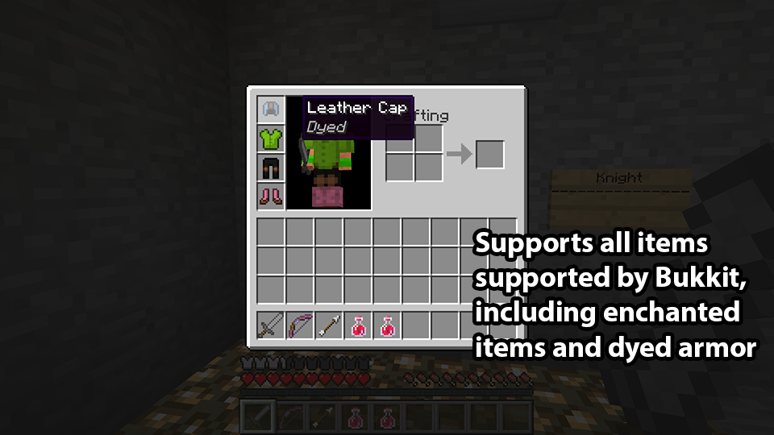
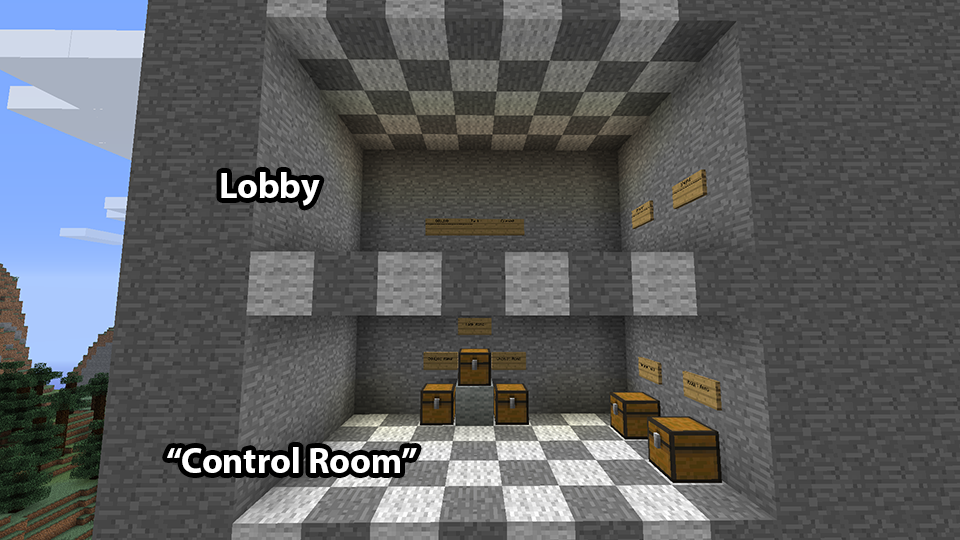
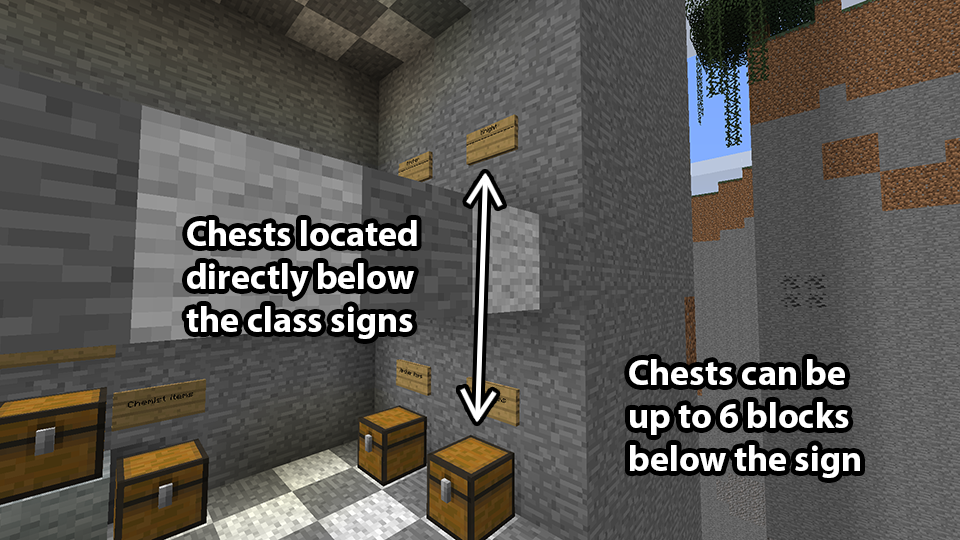
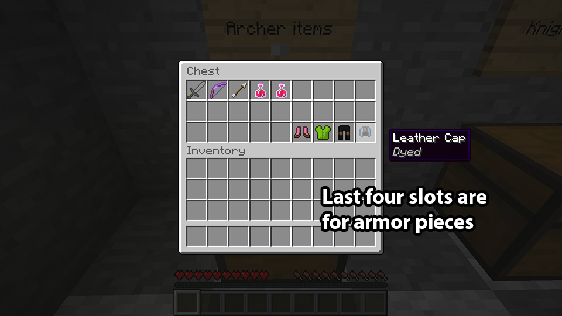

############
Class chests
############

If MobArena's item parser doesn't support your favorite custom items or you want
to configure your class items in-game, class chests are a way to do this.

*********************
Enabling class chests
*********************

Class chests must be enabled in an arena configuration to work. To enable this,
make sure your arena configuration has this line.

.. code-block:: yaml

   use-class-chests: true

Additionally, classes **must** exist in the config file for MobArena to
recognize them. However, the items and armor lists can be empty.

*************
How they work
*************

Class chests support items that are not supported by MobArena's item parser.
Class chests **copy the chest contents** to player inventories. Therefore, any
items supported by Spigot are supported by MobArena.

   Support for custom items, like dyed or enchanted armor, is possible

Class chests are placed *below* the class sign in the lobby. An administrator
fills the chest with whatever items they want the class to have. When the player
chooses the class, the chest contents are copied to the player's inventory.

Using a control room
====================

A "control room" setup works best for this. A control room is an
administrator-only room that holds the class chests. Administrators warp there
to change the contents of the chests.

There's different ways to implement a control room. A common way is to build the
control room underneath the lobby. To later modify the control room, you must
enter Edit Mode (explained in :doc:`arena-setup`). If you want to use a control
room outside of the arena, look into `Linked class chests`_.

   Lobby is above an example control room

Class chests can be…

- No more than *six blocks* from class selection sign
- Placed behind class selection sign

Multiple sign rows
==================

MobArena supports multiple rows of class signs in a lobby with class chests.

#. Place class chests for bottom row of class selection signs six blocks away
#. Place class chests for next row of class selection signs five blocks away
#. Continue until you're out of rows or space

If done correctly, it will look a stair pattern.

   Placing class chests below class selection signs in control room

********************
Auto-equipping items
********************

Special items can be auto-equipped to the player.

Armor
=====

Armor can be auto-equipped from class chests. Place all armor pieces in the
**last four slots of the third row** in the chest.

MobArena checks these four slots for armor. If it finds armor, it equips them
onto the player when they choose the class. Additionally, any item in the last
slot of a chest (bottom right corner) is always equipped as a helmet. This lets
you use non-armor items as helmets.

The order of the other three slots does not matter.

   Armor items are placed in last four slots of third row in chest

Off-hand item
=============

The fifth slot before the end of the third row (next to the armor) is for the
**off-hand item**. This could be a shield or another item of your choice.

*******************
Linked class chests
*******************

Linked class chests allow you to match a single chest for the same class across
multiple arenas. If you have multiple arenas with the same classes, linked class
chests let you manage a single chest for all arenas that use the class.

There can only be one class chest used per class. Using a linked class chest
overrides any local class chests.

To link a chest to a class, look at the chest and use this command.

.. code-block:: text

   /ma classchest <class>

Linked class chests must be removed manually. Open the config file and remove
the ``classchest`` node from the class.
